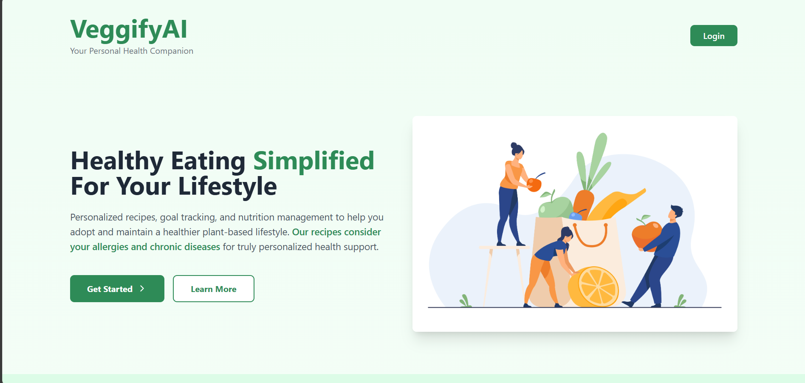
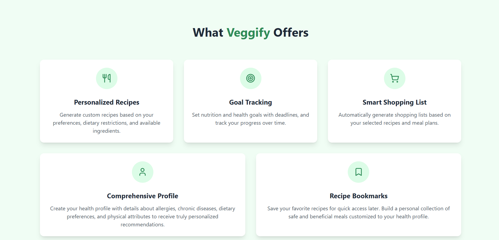
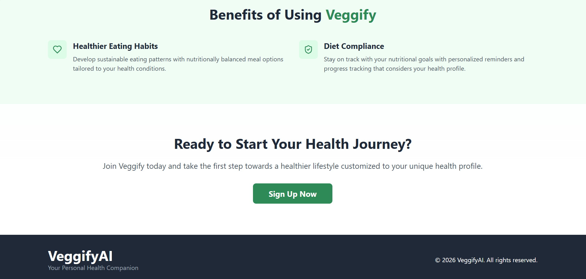
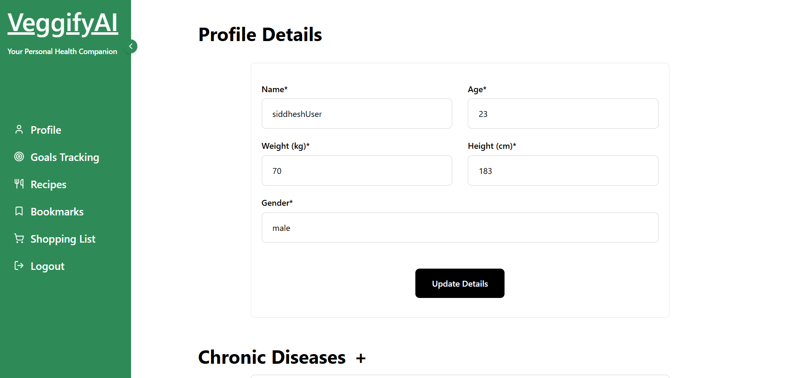
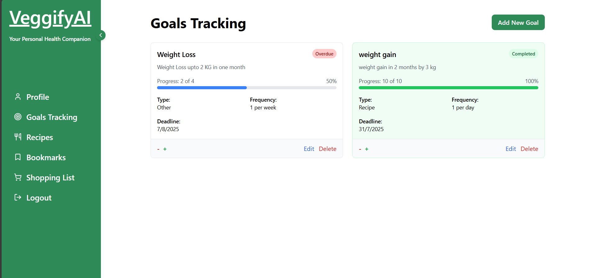
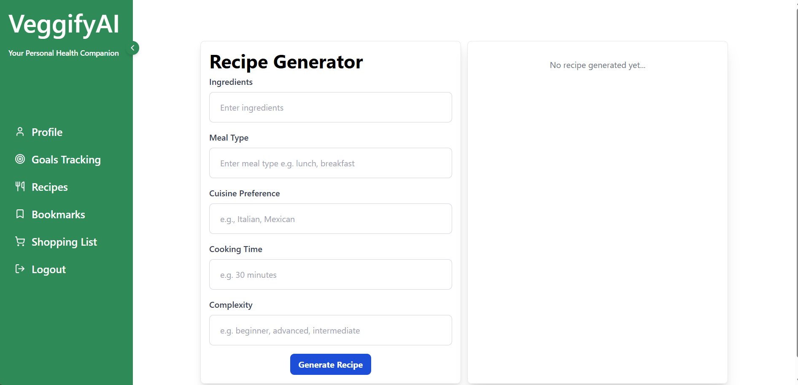
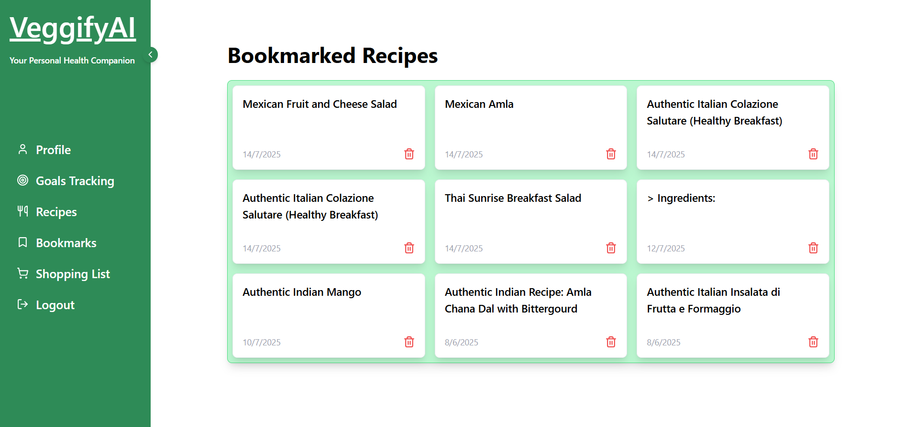
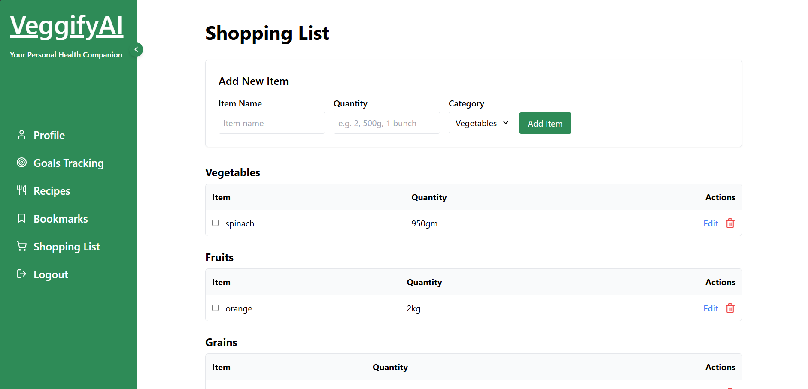

<a name="readme-top"></a>

<div align="center">

</div>

<h1 align="center">VeggifyAI<br/><span style="font-size:10px;">An AI-Powered Nutrition Companion</span></h1>

<div align="center">


</div>

## Tech Stack
<span>


</span>

- **Frontend:** React, Tailwind CSS, Vite
- **Backend:** Node.js, Express
- **Database:** Firebase Firestore
- **AI Service:** OpenAI API
- **Authentication:** Firebase Auth
- **Build Tool:** Vite

<br/>

<h3 align="center"> Your Personal Nutrition Assistant </h3> 
<hr>

# Table of Contents
<details>
<summary>Click to expand</summary>

- [Overview](#overview)
- [Key Features](#key-features)
- [Tech Stack](#tech-stack)
- [Core Functionality](#core-functionality)
- [Installation](#installation)
- [Future Scope](#future-scope)
- [License](#license)
</details>

## Overview
VeggifyAI revolutionizes dietary management through AI-powered personalized nutrition planning. The system addresses critical gaps in existing solutions by offering:
- Dynamic recipe generation accommodating allergies/chronic conditions
- Integrated goal tracking with progress analytics
- Smart shopping list automation
- Secure health profile management

## Project Screenshots

<div align="center">
  








</div>

## Key Features

### Personalized Nutrition
- AI-generated recipes based on dietary needs
- Allergy and health condition filtering
- Nutritional goal tracking

### User Management
- Secure authentication (Google/Email)
- Health profile storage
- Preference management

### Shopping Integration
- Automated grocery list generation
- Real-time synchronization
- Cross-device availability

## System Architecture

### Frontend Components
- Recipe Generator Interface
- User Profile Dashboard
- Goal Tracking System
- Shopping List Manager

### Backend Services
- Recipe Generation API
- User Authentication Service
- Data Storage Layer
- Real-time Sync Engine

## Installation Guide

### Prerequisites
- Node.js (v16+)
- Firebase project
- OpenAI API key

### Setup Instructions
   Create a .env file
   ```bash
   REACT_APP_API_KEY=your_key_here
   OPENAI_API_KEY=your_key_here
   ```
1. Clone the repository and navigate to folder and then install dependencies:
   ```bash
   git clone https://github.com/yourrepo/veggifyai.git
   cd veggifyai or cd VeggifyAI
   npm install
   ```
   
2. Navigate to backend (server folder)
   ```bash
   cd server
   npm run start
   ```
   
3. Then,Start the frontend
   ```bash
   npm run dev
   ```
   
   
## Core Functionality

### Recipe Generation
1. User inputs preferences (ingredients, meal type, cuisine)
2. System processes with OpenAI API
3. Returns allergy-safe, nutritionally balanced recipes
4. Displays in clean Markdown format
